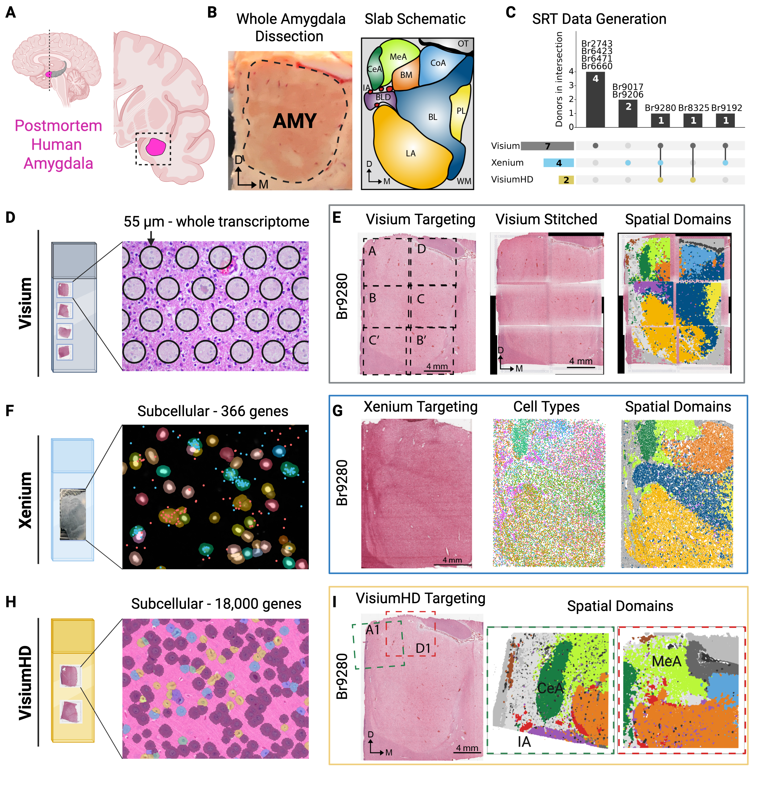

# Multiscale spatial transcriptomics resolves the cellular and molecular architecture of the human amygdala

## Overview

Welcome to the `spatialAmygdala` project! In this study, we generated
spatially-resolved transcriptomics (SRT) data from postmortem tissue sections of the human amygdala across  adult neurotypical donors. SRT data was generated using
[10x Genomics **Visium**](https://www.10xgenomics.com/products/spatial-gene-expression) (n=7 donors), [10x Genomics **Xenium**](https://www.10xgenomics.com/platforms/xenium) (n=4 donors), and [10x Genomics **Visium HD**](https://www.10xgenomics.com/products/visium-hd-spatial-gene-expression) (n=5 capture areas). 

Thank you for your interest in our work!

## Study design

**Postmortem human brain tissue collection and spatial transcriptomics data generation.** (A) The human amygdala (pink) in midsagittal (left) and coronal (right) views; the dashed line marks the coronal level and the dashed box the dissected brain block. (B) Dissected coronal block with the amygdala (AMY) outlined (left) and a schematic of amygdala subnuclei at the corresponding A-P level (right). (C) UpSet plot of donors across the three SRT platforms: Visium (n=7), Xenium (n=4), and Visium HD (n=2), with Br9280 profiled on all three. (D) The Visium slide carries four 6.5 mm² capture arrays of ~5,000 barcoded 55 µm spots, capturing the whole transcriptome across multiple cells per spot. (E) Visium workflow for representative donor Br9280: AMY tissue is scored into six 6.5 mm² strips matched to the capture arrays (Visium Targeting), then H&E and SRT data are reassembled to represent the whole tissue (Visium Stitched) and spatial domains are defined. (F) The Xenium slide carries a single large capture array with probes for 366 genes, allowing subcellular resolution. (G) Xenium workflow for Br9280: unscored AMY tissue is placed on the array (Xenium Targeting), and subcellular resolution resolves cell types and spatial domains within the sample. (H) The Visium HD slide carries two 6.5 mm² capture arrays with a continuous lawn of 2 µm barcodes, resolving ~18,000 genes subcellularly. (I) Visium HD workflow for Br9280: AMY tissue is scored into two 6.5 mm² strips (Visium HD Targeting), and detailed spatial domains are determined for selected subnuclei: IA, CeA, and MeA.
[Biorender](https://biorender.com))

## Interactive Websites

All of these interactive websites are powered by the [`Vitessce`](http://vitessce.io/) open source software:

We provide the following [interactive websites](https://totty-amygdala-vitessce.s3.amazonaws.com/amygdala/index.html), organized by dataset with
software labeled by emojis:

- [Visium (n = 7)](https://vitessce.io/#?url=https://totty-amygdala-vitessce.s3.amazonaws.com/amygdala/configs/visium.json)
    + Provides interactive spot-level visualization of full-transcriptome profiles, spatial domains, 
    and predicted cell type locations.
- [Xenium (n = 4)](https://vitessce.io/#?url=https://totty-amygdala-vitessce.s3.amazonaws.com/amygdala/configs/xenium.json)
    + Provides interactive cell segmentations with a targeted gene panel, spatial domain, and transferred cell type labels.
- [Visium HD (n = 5)](https://vitessce.io/#?url=https://totty-amygdala-vitessce.s3.amazonaws.com/amygdala/configs/visium_hd.json)
    + Provides interactive cell segmentations with full-transcriptome profliling, spatial domains, and 
        transferred cell type labels.
- [Br9280: Visium, VisiumHD, and Xenium](https://vitessce.io/#?url=https://totty-amygdala-vitessce.s3.amazonaws.com/amygdala/configs/all_platforms.json)
    + Provides interactive visualize of the same donor across all three technologies.

## Data Access

All raw FASTQ files can be accessed via Gene Expression Omnibus (GEO) under
accessions [GSE342709 (Visium)](https://www.ncbi.nlm.nih.gov/geo/query/acc.cgi?acc=GSE342709), [GSE342289 (Xenium)](https://www.ncbi.nlm.nih.gov/geo/query/acc.cgi?acc=GSE342289), and [GSE342738 (VisiumHD)](https://www.ncbi.nlm.nih.gov/geo/query/acc.cgi?acc=GSE342738).

Processed [SpatialExperiment](https://github.com/drighelli/SpatialExperiment) objects can be downloaded directly via Globus link below:
 - [Link to processed data](https://app.globus.org/file-manager?origin_id=1e55be8f-3d91-4e30-917a-59ae8b2aecfb&origin_path=%2F)

## Contact

We value feedback and public questions, as they allow other users to learn from the answers.
If you have any questions, please ask them at
[LieberInstitute/spatialAmygdala/issues](https://github.com/LieberInstitute/spatialAmygdala/issues)
and refrain from emailing us. Thank you again for your interest in our work!

## How to Cite

Totty, M. S., Bach, S. V., Valentine, M. R., Tippani, M., Maguire, S. E., Del Rosario Alvia, I., Miller, R. A., Kleinman, J. E., Maynard, K. R., Page, S. C., Hyde, T. M., Hicks, S. C., & Martinowich, K. Multiscale spatial transcriptomics resolves the cellular and molecular architecture of the human amygdala. bioRxiv doi:10.64898/2026.08.22.746381.

## Internal

JHPCE location: `/dcs04/lieber/marmaypag/spatialAMY_LIBD4125/spatialAmygdala/`
